  

<b>NYU · Data Science Major · Business Studies Minor · Class of 2028</b>

I like turning everyday problems into useful technology that is easy and enjoyable to use.

  

---

### A little about me ✦

I'm **Zahyra**, a Data Science student at **New York University** exploring the space between data, software, AI, and product.

I like working on ideas that come from problems I notice in everyday life, whether that means simplifying a complicated process, making information easier to understand, or helping people find a useful resource. I care about building things that feel **accessible, intentional, and genuinely enjoyable to use**.

Right now, I’m especially interested in consumer technology, beauty, entertainment, and other spaces where data and thoughtful design can shape a better experience.

> **notice a problem → understand who it affects → build something useful**

### Projects & experience ୨୧

| Project | What I worked on | Focus |
| :--- | :--- | :--- |
| **[Be1space](https://be1space.vercel.app/)** ↗ | A web app helping NYU students discover affordable, accessible study spaces across NYC. Built frontend experiences for discovery, favorites, authentication, profiles, and location-based browsing. | Product · Frontend · Accessibility |
| **[HVAC Margin Rescue](https://the-hvac-margin-rescue-challenge.vercel.app/)** ↗ | A full-stack datathon project that surfaced financially at-risk HVAC projects. Connected AI analysis to the frontend and translated project data into clear, actionable risk insights. | Data · AI · Full Stack |
| **Eclipse at JGM Innovation** | Contributed to an internal AI-powered application during my internship. Worked across UI/UX, prompt design, feature development, and workflow automation, including improvements to the chatbot experience. | AI · UI/UX · Automation |
| **Something new is blooming…** | A personal data/product project is currently taking shape. | Coming soon ✦ |

### My toolkit

  

**Data & AI** · SQL · pandas · NumPy · Matplotlib · Azure AI · prompt engineering 
**Build & automate** · REST APIs · Zapier · Google Apps Script · Git · GitHub 
**Design & organize** · Figma · Wix · Google Sheets · VS Code

### Beyond the build ♡

Outside of coding, I love beauty and skincare, exploring NYC, and finding cute cafés and study spots. I’m also always thinking about new creative ideas and products I’d want to build.

---

  <h3>Let’s make something useful and lovely.</h3>
  
Open to learning, collaborating, and building thoughtful things.

  
  
  
    
  designed with intention, curiosity & a little sparkle ✦

